# Hello there, I'm Stephen! 👋

I'm a third-year **Computer Science student at the University of Waterloo** 📚, specializing in Machine Learning and Full Stack Development. My career goal is to innovate and make a significant impact as a Machine Learning Engineer.

I'm eager to apply my skills in a challenging co-op position for the Winter and Summer of 2025.

## Skills

Languages

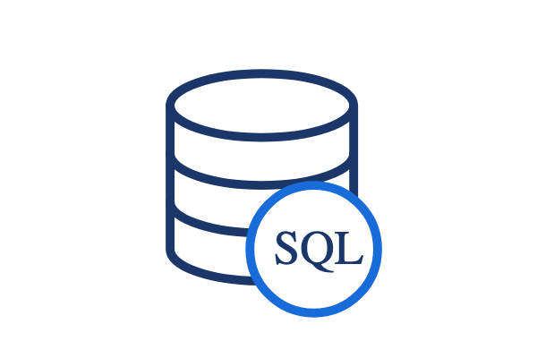
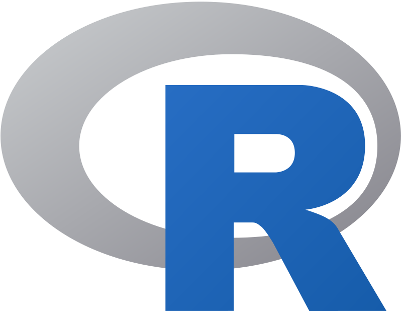
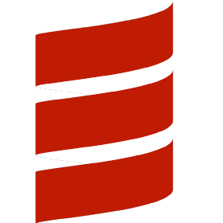
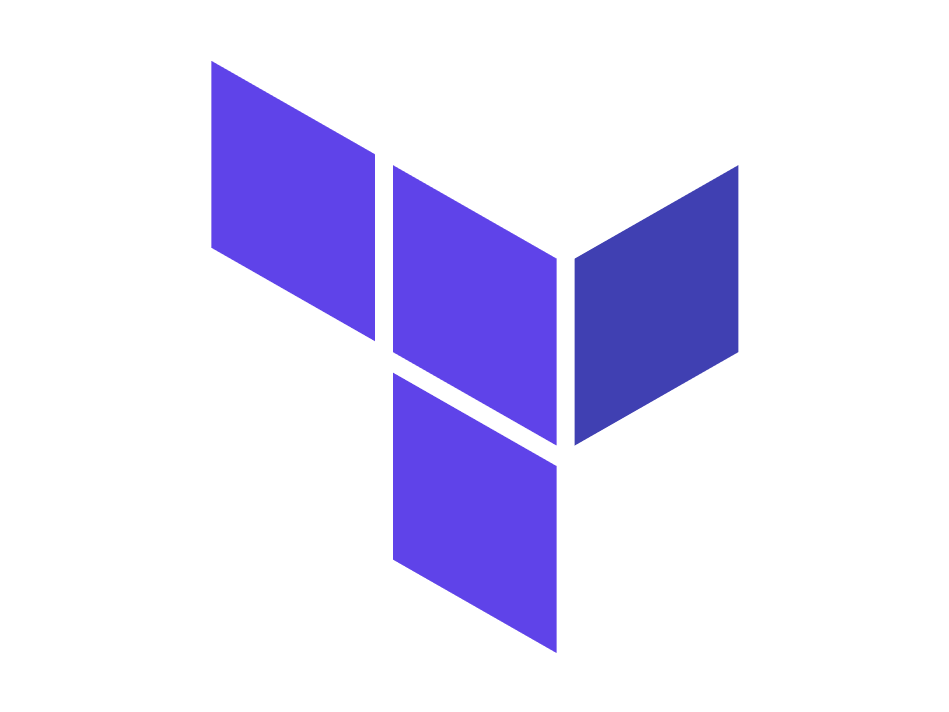

 

Machine Learning

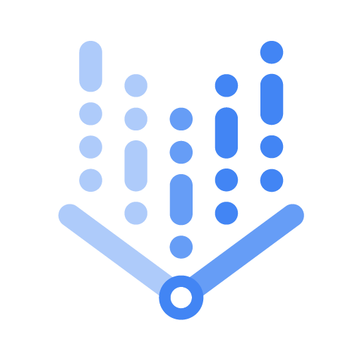
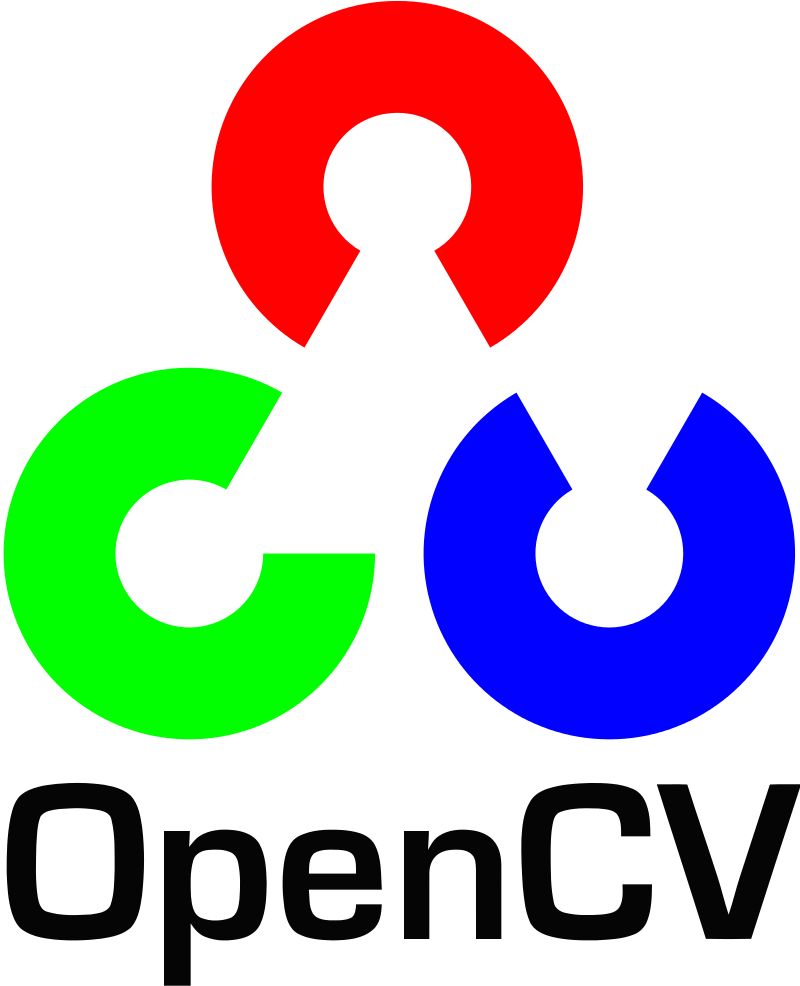

 

Web

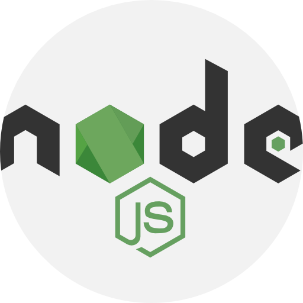
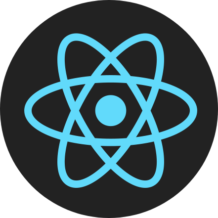
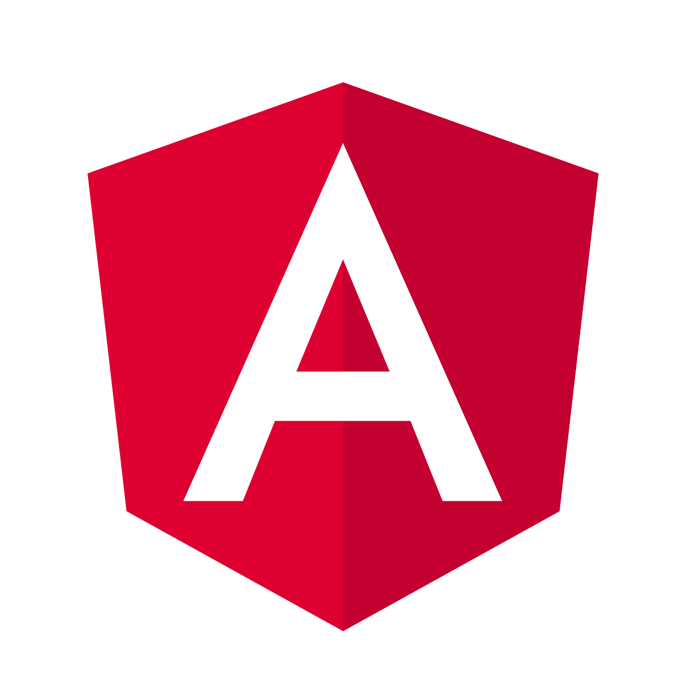
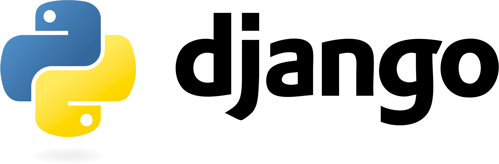
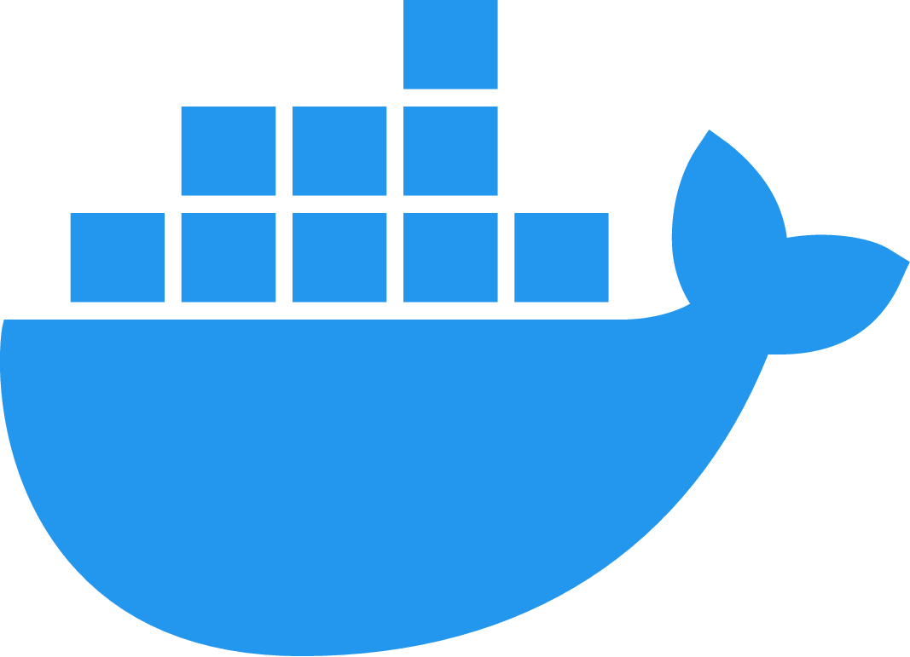
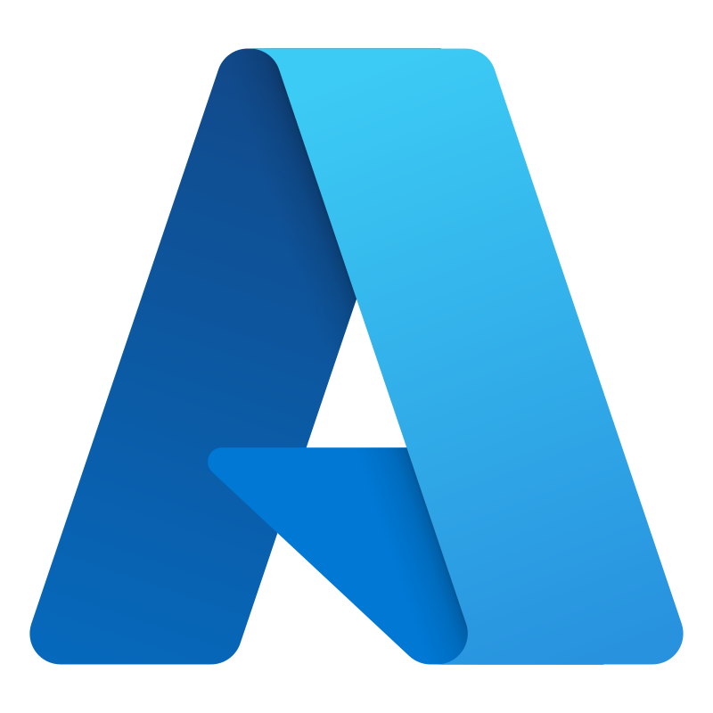
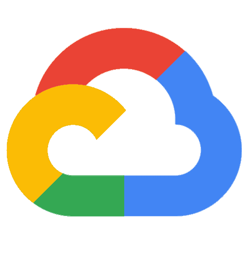
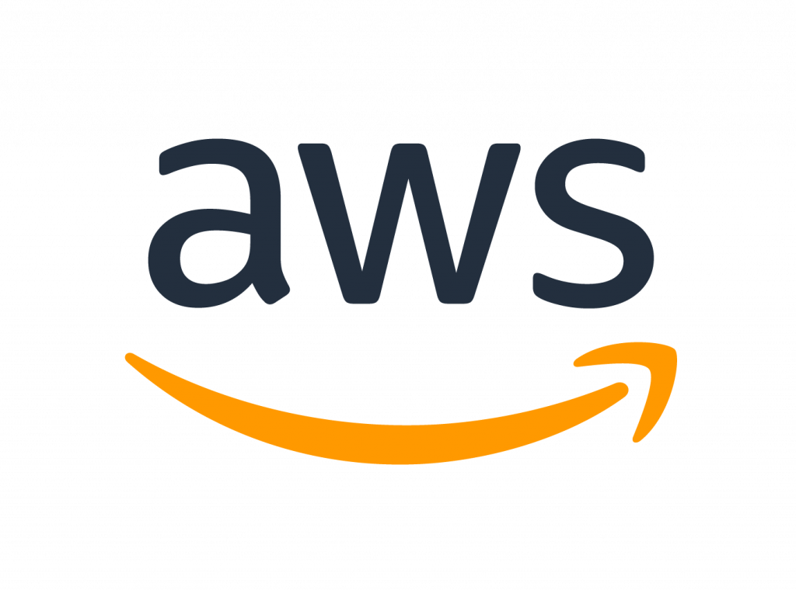
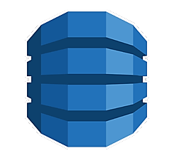
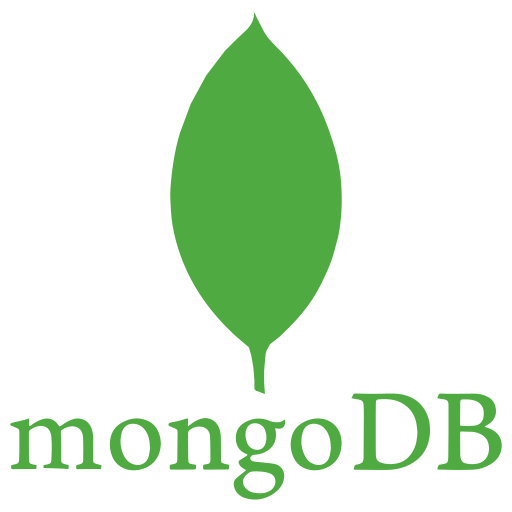

## Experience

- I interned at [Compass Digital](https://compassdigital.io/) as a data science intern, developing **AI-driven** solutions to address complex business challenges
- I interned at [Met-Scan Canada](https://www.met-scan.com/) as a machine learning researcher, training **deep learning models** for indoor localization
- I interned at [Marsh & Mclennan Companies](https://www.mmc.com/) and [Invafresh](https://www.invafresh.com/) as a software developer, building **full-stack applications**

## Contact

<!--
**StephenHuang3/StephenHuang3** is a ✨ _special_ ✨ repository because its `README.md` (this file) appears on your GitHub profile.

Here are some ideas to get you started:

- 🔭 I’m currently working on ...
- 🌱 I’m currently learning ...
- 👯 I’m looking to collaborate on ...
- 🤔 I’m looking for help with ...
- 💬 Ask me about ...
- 📫 How to reach me: ...
- 😄 Pronouns: ...
- ⚡ Fun fact: ...
  -->
